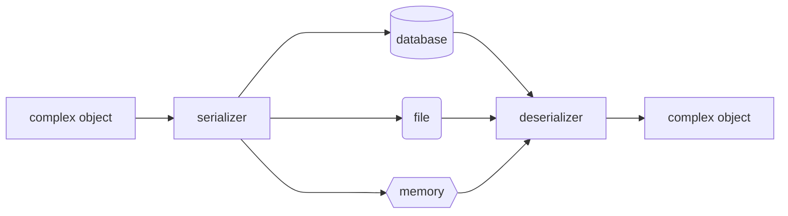

## wrapping API view
- The ```@api_view ``` decorator for working with function based views.
- The ```APIView``` class for working with class-based views.

- The Response class for returning responses from API views.

## @api_view decorator
@api_view decorator is used to convert function based views into API views. It takes a list of HTTP methods that the view should respond to as its only argument. If the incoming request doesn't match one of the specified methods, a 405 Method Not Allowed response will be returned.
see [views.py /home](../API/views.py)
```python
@api_view(['GET','POST','DELETE']) # or http_method_names = ['get']    
def home (request)-> Response:
    if request.method == 'GET':
         return Response({
        'message': 'Hello World!',
        'status':200,
        'method':'GET'
        })
    if request.method == 'POST':
         return Response({
        'message': 'Hello POST',
        'status':200,
        'method':'POST'
        })
    if request.method == 'PUT':
            return Response({
            'message': 'Hello PUT',
            'status':200,
            'method':'PUT'
            })
    if request.method == 'DELETE':
            return Response({
            'message': 'Hello DELETE',
         'status':200,
            'method':'DELETE'
            })
    else :
          return Response({
        'message': 'Hello torilaurey',
        'status':405,
        'method':'Method Not Allowed'
          })
```


## Serializers 
seralizer are used to convert complex data such as querysets and model instances into native Python datatypes that can then be easily rendered into JSON, XML or other content types. Serializers also provide deserialization, allowing parsed data to be converted back into complex types, after first validating the incoming data.

**deserialization** is the process of converting data from a format that is easy to store or transmit to a format that is easy to use.

**model serializer** is a shortcut for creating serializer classes:
- An automatically determined set of fields.
- Simple default implementations for the create() and update() methods.

lets create model and searilize that 
```python
models.py

class Todo(BaseModel):
    title=models.CharField(max_length=255)
    description=models.TextField()
    completed=models.BooleanField(default=False)
    due_date=models.DateField(null=True, blank=True)

    def __str__(self):
        return self.title

```
*serializers.py*

```python
!usr/bin/env python3
serializers.py

from rest_framework import serializers

from .models import Todo

class TodoSerializer(serializers.ModelSerializer):
    class Meta:
        model=Todo
        fields='__all__'  
```
**how serializers are used in Django views** 
```python
views.py
@api_view(['POST']) 
def create_todo(request)->Response:
        try:
            data = request.data
            serializer = TodoSerializer(data=data)
            print (data)
            if serializer.is_valid():
                  print(serializer.data)
                  return Response({ 
                        'status':200,
                        'message':'Todo created successfully',
                        'data':serializer.data
                  })
        except Exception as e:
            return Response({
                  'status':500,
                  'message':str(e),
                  'data':{}
            })
```


<br>[official documentation](https://www.django-rest-framework.org/api-guide/serializers/)

##for [crud operations](./basic_CRUD.md) visit this link