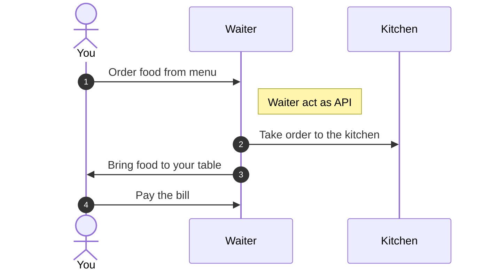
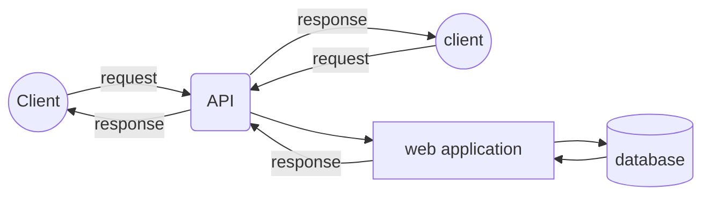
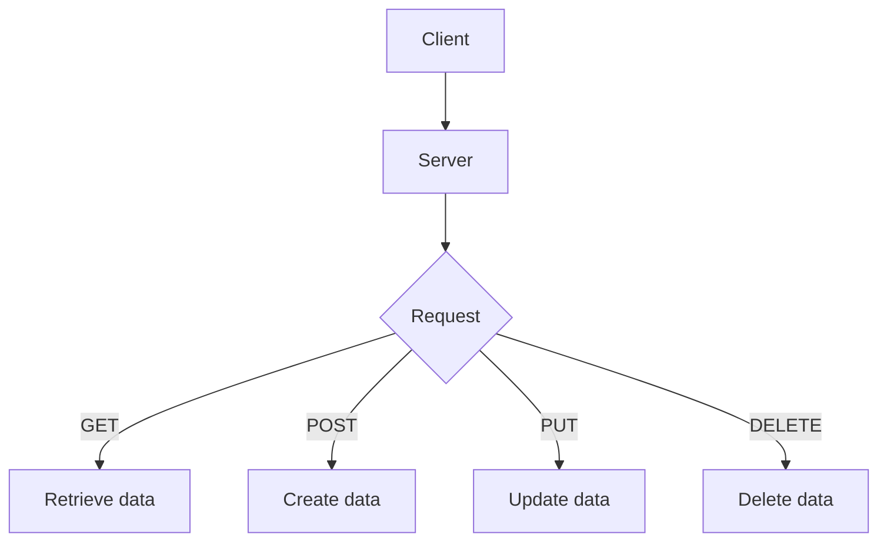

## What is API? 
API stands for Application Programming Interface. It is a set of functions and procedures that allow the creation of applications that access the features or data of an operating system, application, or other service.
**example** *(resturant)*:
- You order food from the menu.
- The waiter takes your order to the kitchen.
- The chef prepares your order.
- The waiter brings your food to your table.
- You eat your food.
- You pay the bill.
- The Waiter act as API between you and the kitchen.

## What is REST?
REST stands for REpresentational State Transfer. It is an architectural style for providing standards between computer systems on the web, making it easier for systems to communicate with each other. REST-compliant systems, often called RESTful systems, are characterized by how they are stateless and separate the concerns of client and server.

## What is REST API?

REST API is an application program interface (API) that uses HTTP requests to GET, PUT, POST and DELETE data.

## Go to [docs](./docs/basic.md)  learn more about Django REST framework 

       

